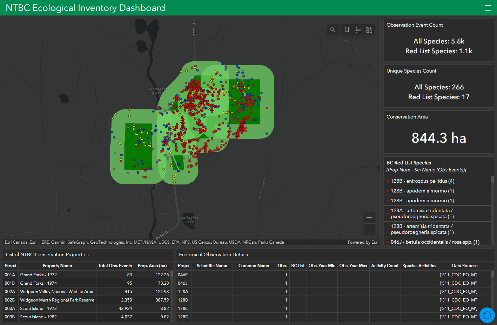
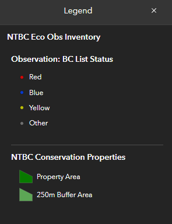
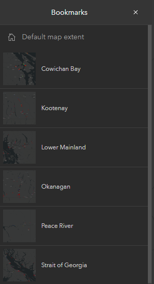
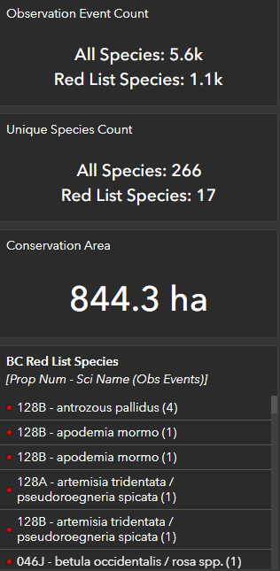
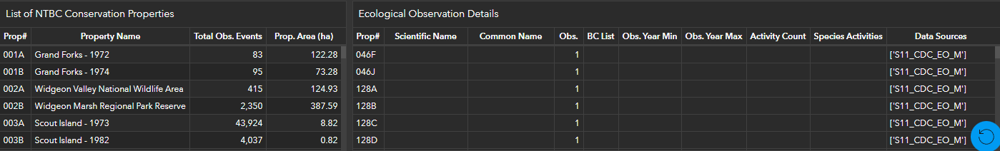

# NTBC Ecological Observation Inventory Dashboard

## Introduction
As part of the BCIT GIS Advanced Diploma program I completed a project for the Nature Trust of BC (NTBC). The product I created for NTBC is called the Ecological Observation Inventory Analysis (EOIA) and it is a colletion of scripts that compile and analyze ecological observation data. The main script is a Python toolbox written using ArcPy and designed to work within ArcGIS Pro 2.9 or higher.

The project involved gathering ecological occurrence data from publicly available sources and completing analysis on the data to create summary tables and statistics of ecological occurrence data for each NTBC conservation property. The summary tables and statistics are meant to assist and inform conservation planning at NTBC. To generate the final project ouputs, over 28 million point and polygon ecological observation features were processed. The NTBC Ecological Observation Inventory Dashboard showcases a portion of the final outputs produced from the project. 

### Project Statement
With input from NTBC staff, the student will compile a spatial database of ecological occurrence data available at a provincial scale. The student will also develop processes to produce different types of summary statistic outputs for use by NTBC staff in conservation planning. It is important to ensure that the methods are well documented and repeatable, ideally confined to a model or script created using ArcGIS Model Builder or ArcPy.

### Purpose of the Dashboard
The dashboard provides visualization of, and dynamic statistics for, the "Summary by Property Acquisition Number", which is one of the summary outputs created by the EOIA. The dashboard has been designed to highlight observations of species that are on BC's Red List. Species on the Red List include any species or ecosystem that is at risk of being lost (extirpated, endangered or threatened). The dashboard clearly displays information about the species at risk that have been observed in each NTBC conservation property.

## About the App

### The Map

The map displays ecological observation data as well as conservation property data. The legend below describes the sybmology of the data and can be accessed on the map itself by clicking the middle "list/legend" button in the top right of the map area.

The default view of the map is set to an overview of BC. The map also has preset bookmarks for convenient navigation to certain areas within BC. Bookmarks can be accessed via the "ribbon/bookmark" button in the top right of the map area.

### Dynamic Statistics
The Dashboard provides dynamic statistics based on the information currently visible in the map frame. Statistics are provided for the following data:
- Observation Event Count: count of observation events visible on the map frame for "All Species" and for "Red List Species"
- Unique Species Count: count of unique species observed on the map frame for "All Species" and for "Red List Species"
- Conservation Area: the sum of the property and buffer areas visible on the map frame, in hectares.
- BC Red List Species: list of BC Red List Species observed on the map frame.

### Tables
Two tables are provided at the bottom of the dashboard.

Table Descriptions: 

List of NTBC Conservation Properties: this is a static table of all the conservation properties included in the analysis. The "Total Obs. Events" column represents the number of observation events found within a conservation property as well as its surrounding buffer area. The "Prop. Area (ha)" column represents the area of the conservation property (not including the surrounding buffer area).

Ecological Observation Details: this is a dynamic table of all the summaries of ecological observations by property number and scientific name. The table only displays ecological observations currently visible on the map frame. Explanations of certain fields are provided below:
- "Obs.": Count of observation events contributing to the entry
- "BC List": the BC List status of the species
- "Obs. Year Min" and "Obs Year Max": repsectively provide the oldest and most recent observation years of the species within the property/buffer
- "Activity Count": a count of observation events that contain "Activity" data
- "Species Activity": a list of "Activity" values for the species record
- "Data Sources": a list of sources that contributed to the species record, see the data dictionary below for the sources and their naming codes

## Data Dictionary
| <b>Dataset</b> | <b>Data Source</b> | <b>Data Type</b>
| --- | --- | --- |
| NTBC Properties | NTBC | Polygon |
| BC Species list | <a href="https://a100.gov.bc.ca/pub/eswp/search.do?method=reset">BC Species & Ecosystems Explorer</a> | Table |
| eBird Basic Dataset (S02_EBD) | <a href="https://support.ebird.org/en/support/solutions/articles/48000838205-download-ebird-data">eBird</a> | Point |
| iNaturalist Observations (S03_iNat) | <a href="https://inaturalist.ca/home">iNaturalist</a> | Point |
| SPI Masked Survey Observations - Publicly Available (S04_SPI_SO_M) | <a href="https://catalogue.data.gov.bc.ca/dataset/wildlife-species-inventory-masked-survey-observations-publicly-available">BC Data Catalogue</a> | Polygon |
| SPI Survey Observations - Non-Sensitive (S05_SPI_SO_NSn) | <a href="https://catalogue.data.gov.bc.ca/dataset/wildlife-species-inventory-survey-observations-non-sensitive">BC Data Catalogue</a> | Point |
| SPI Masked Feature Observations - Publicly Available (S06_SPI_FO_M) | <a href="https://catalogue.data.gov.bc.ca/dataset/wildlife-species-inventory-masked-feature-observations-publicly-available">BC Data Catalogue</a> | Polygon |
| SPI Feature Observations - Non-Sensitive (Wildlife Habitat Features - FRPA) (S07_SPI_FO_NSn) | <a href="https://catalogue.data.gov.bc.ca/dataset/wildlife-habitat-features-frpa">BC Data Catalogue</a> | Point |
| SPI Incidental Observations - Non-Secured (S08_SPI_TO_NSn) | <a href="https://catalogue.data.gov.bc.ca/dataset/wildlife-species-inventory-incidental-observations-non-secured">BC Data Catalogue</a> | Point |
| SPI Telemetry Observations - Non-Sensitive (S09_SPI_TO_NSn) | <a href="https://catalogue.data.gov.bc.ca/dataset/wildlife-species-inventory-telemetry-observations-non-sensitive">BC Data Catalogue</a> | Point |
| CDC Element Occurrences: Species and Ecosystems at Risk - Publicly Available Occurrences (S10_CDC_EO) | <a href="https://catalogue.data.gov.bc.ca/dataset/species-and-ecosystems-at-risk-publicly-available-occurrences-cdc">BC Data Catalogue</a> | Polygon |
| CDC Element Occurrences: Species and Ecosystems at Risk (Masked Secured) (S11_CDC_EO_M) | <a href="https://catalogue.data.gov.bc.ca/dataset/species-and-ecosystems-at-risk-masked-secured-publicly-available-occurrences-cdc">BC Data Catalogue</a> | Polygon |

## Links
- <a href="https://experience.arcgis.com/experience/9f5e1b7057da4f939e020e861d85e788">NTBC Ecological Inventory Dashboard</a>
- <a href="https://www.naturetrust.bc.ca/">Nature Trust of British Columbia</a>
- <a href="https://www.bcit.ca/programs/geographic-information-systems/">BCIT GIS</a>
- <a href="https://www.linkedin.com/in/michael-wong-526098214/">Michael Wong - LinkedIn</a>

